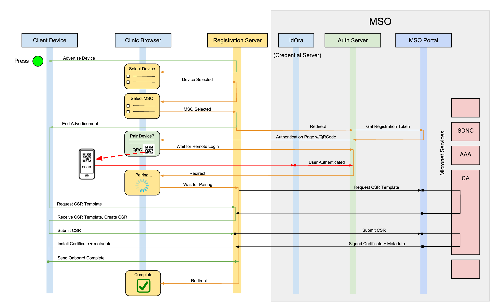

# reg-server

This is a public facing server used by medical facilities (e.g. clinics) to onboard a medical device to an MSO subscriber's account. Specifically, it facilitates the installation of the credentials required to connect the device to the subscriber's WiFi network.

## Overview
Implemented using Node.js, it has 4 distinct route tables:

- index (clinic browser) default route, redirects to /device-list
- portal (clinic browser) clinic UI - list devices, select device, authorize device
- device (medical device) advertise, request certificates, pairing complete

## Requirements
- node.js version 8.0 or above (tested with 8.9 on MacOS Sierra) [download](https://nodejs.org/en/download/)
- jq (JSON parser, required **ONLY** if you need to use the test scripts) [download](https://stedolan.github.io/jq/download/)

## OpenSSL
We use OpenSSL as a local CA. **This is required ONLY when using the test scripts** (we need to create a CSR). Everything needed should be in the `test/ca` folder.

**IMPORTANT** - Before using the local CA for the first time:

    cd test/ca
    ./initca

This will create `index.txt` and `serial`. **These files are not checked into the repo.**

## Registration Token
The registration token is used to identify an onboarding session. It is generated by the MSO Portal and contains all of the metadata presented by the device at the time it is advertised. The MSO Portal can decrypt this token when presented to reveal the device attributes and other information about the registration sequence.

## Configuration
- modify `lib/config.js` to provide default endpoints to the mso-portal and auth-server instances
- modify `/etc/micronets/config/reg-server.conf` when running as a docker container to override endpoints (see `micronets` repo readme)
- pre-provision the medical device to connect to the Registration Server when the onboarding button is pressed.
  * This is done by updating `/etc/micronets/config/registration.conf` on the Raspberry Pi Zero W device.

## Runtime Dependencies
 - mso-portal or mso-portal-stub (MSO Portal), and any upstream components, eg. micronets CA, subscriber DB, etc.
 - micronets-authorizationServer (Authorization Server)
 - idora-server (IdOra Certificate Server)

## Onboarding Sequence

### Clinic representative opens the registration application on the Registration Server - `GET /portal/device-list` 
 - Advertised (available) medical devices (or test scripts) appear on screen when they activate the onboarding process.

### Advertise Device
 - Run `$ ./test/scripts/onboardDevice.sh` script in a terminal window or push the onboarding button on the medical device. This will connect to localhost unless a base URL for the registration server is presented as the first argument.
 - The device sends a `POST /advertise` to the Registration Server. This is a LONG POLL and does not return until the device has been selected and pairing with a subscriber has begun.
 - The registration server responds to update polling from the clinic browser and displays the device information.

### Select Device
 - The clinic representative selects the device to be onboarded.

### Select MSO
 - After the device has been selected, the user must select their network provider (MSO). This is used to determine the correct endpoints for auth-server and mso-portal

### Present Subscriber Authorization Screen
 - The registration application redirects to the Authorization Server - `GET /register-device`. This is a LONG POLL and does not return.
 - The Authorization Server obtains a registration token by sending a `POST /portal/registration-token` to the MSO Portal.
 - The Authorization Server returns an authorization page containing the selected device information and a QRCode.

### Authorized Device Provisioning
 - The subscriber scans the QRCode with an MSO provided mobile scanner application (or click on QRCode for testing)
 - The scanner application sends the session information extracted from the QRCode to the Idora Credential Server
 - The Idora Credential Server sends a `POST /authSession` request to the Authorization Server.
 - The Authorization Server ends the `/register-device` long poll, returning the registration token, deviceID, subscriberID and SSID to the clinic browser registration application.

### Pair Device
 - The clinic browser registration application redirects itself back to the Registration Server using `POST /portal/pair-device`.
 - The `pair-device` page displays pairing information and a progress bar for the duration of the pairing process.

### Request CSR Template
 - The Registration Server sends a `POST /ca/csrt` request to the MSO Portal.
 - The MSO Portal generates the template and returns it to the Registration Server.
 - The Registration Server ends the `/device/advertise` long poll, returning the CSRT and the registration token to the device (or test script).

### Request WiFi certificate
 - The device creates and signs a CSR using its private key and the keyType (eg. RSA:2048)
 - The device (or test script) sends a `POST /device/cert` request to the Registration Server with the CSR and the device token.
 - The Registration Server forwards the request to the MSO Portal endpoint `POST /ca/cert`.
 - The MSO Portal forwards the request to the Identity Service Root CA.
 - The signed WiFi certificate, CA certificate, and subscriber metadata are returned to the Registration Server and then back to the device.

### Install device credentials
 - The device installs the certificates and updates the WPA supplicant configuration required to connect to the subscribers WiFi access point.
 - The device sends a `POST /pair-complete` request to the Registration Server.
 - The Registration Server updates the pairing status and the clinic browser page updates to reflect that the pairing is complete.

## Public REST Interface

### Advertise Device:
Origin: Device
Method: POST

The device metadata is sent to the registration server. The server stores this in a device map and retains/updates it throughout the pairing process. Note that this is a long poll. A response is not sent until the device is selected, authorized, and a CSRT is generated and returned.

#### url: `/device/advertise`

Header Fields:

    content-type: "application/json"

POST data:

    {
      "deviceName": "ProtoMed 2",
      "vendor": "AcmeMeds",
      "modelUID64": "BQ0LDQsMDAM",
      "macAddress": "B8:27:EB:D8:DF:30",
      "deviceConnection": "wifi",
      "deviceID": "ecea43279f2b5e89d3d49537c194b956f4863612606f8a2039fca7ac64b61de1",
      "model": "Heart-Assure",
      "modelUID64": "BQ0LDQsMDAM",
      "type": "Heartrate Monitor",
      "class": "Medical",
      "serial": "AH-64B61DE1"
    }

#### response:

Note: This is a long poll. See above description.

    {
      "csrTemplate": {
        "keyType": "RSA:2048"
      },
      "token": "RLHEE"
    }

### Cancel Device Advertisement:
Origin: Device
Method: POST

The device advertisement, if active, is canceled

#### url: `/device/cancel`

Header Fields:

    content-type: "application/json"

POST data:

  {
      "UID": "584BB997-3193-4CD0-BD42-4E9359A58E81",
  }

#### response:
  Long poll is terminated with a 204 No Data
  This request returns 200 if long poll in progress, else 404

### Request Certificate
Origin: Device
Method: POST

A CSR and a registration is presented. The request is forwared to the MSO Portal and a signed WiFi certificate, CA certificate, and subscriber metadata is returned.

#### url: `/device/cert/`

Header Fields:

    content-type: "application/json"
    authorization: "<registration token>"

POST data:

    {
      "csr": "<base64 encoded CSR>"
    }

**NOTE:** The CSR, wifiCert and caCert are base64 encoded to preserve line endings. **REQUIRED!**

#### response:

    {
  	  "subscriber": {
  		  "id": 1,
  		  "name": "Grandma",
  		  "ssid": "Grandma's WiFi"
  	  },
  	  "wifiCert": "<base64 encoded WiFi Certificate>",
  	  "caCert": "<base64 encoded CA Certificate>"
    }

### Pair complete
Origin: Device
Method: POST

The device has received and installed the requested certificates and updated the WPA supplicant configuration.
#### url: `/device/pair-complete`

Header Fields:

    content-type: "application/json"
    authorization: "<registration token>"

POST data:

    {
      "uid": "<deviceID>"
    }

#### response:
Empty response

## Layout
- *reg-server.js* - application wrapper (http server)
- *app.js* - application main
- *lib/* - local modules
- *node-modules/* - installed modules
- *doc/* - documentation files
- *public/* - express resources (images, .js, .css, etc)
- *routes/* -
	- *index.js* - default routes (not used)
	- *portal.js* - non-ca urls (registration token)
	- *ca.js* - ca urls (not used)
	- *internal.js* - private API (accounts/billing, etc)
- *test/* -
	- *ca/* - local CA files
	- *client/* - client files generated by the test scripts (keys, token, deviceID, csr, certs, etc)
	- *scripts/* - (no arguments required. Results are stored in `test/client` folder)
		- *onboardDevice.sh* - simulates a physical medical device for the onboarding sequence.
- *views/* - express templates (pug)

